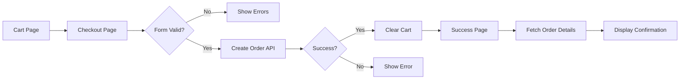

# Phase 4: Checkout & Order Flow - Walkthrough

## Summary

Successfully implemented the complete checkout flow for the E-commerce frontend, including checkout page, customer information form, order creation with idempotency support, and order confirmation page.

---

## Files Created

### Utility Updates

#### [utils.ts](file:///home/sotatek/Develop/My_Self/Mordern_Java/ecommerce-frontend/src/lib/utils.ts)
Added `generateIdempotencyKey()` function for generating unique idempotency keys used in order creation API calls.

```diff
+/**
+ * Generate a unique idempotency key for API requests.
+ * Used to prevent duplicate order creation on retries.
+ */
+export function generateIdempotencyKey(): string {
+  return `${Date.now()}-${Math.random().toString(36).substring(2, 11)}`;
+}
```

---

### Checkout Components

| File | Purpose |
|------|---------|
| [CheckoutFormSchema.ts](file:///home/sotatek/Develop/My_Self/Mordern_Java/ecommerce-frontend/src/components/features/checkout/CheckoutFormSchema.ts) | Zod validation schema for checkout form |
| [CheckoutSummary.tsx](file:///home/sotatek/Develop/My_Self/Mordern_Java/ecommerce-frontend/src/components/features/checkout/CheckoutSummary.tsx) | Order summary showing cart items and totals |
| [CustomerInfoForm.tsx](file:///home/sotatek/Develop/My_Self/Mordern_Java/ecommerce-frontend/src/components/features/checkout/CustomerInfoForm.tsx) | Customer ID input form with react-hook-form |
| [CheckoutLayout.tsx](file:///home/sotatek/Develop/My_Self/Mordern_Java/ecommerce-frontend/src/components/features/checkout/CheckoutLayout.tsx) | Responsive two-column layout wrapper |
| [OrderConfirmation.tsx](file:///home/sotatek/Develop/My_Self/Mordern_Java/ecommerce-frontend/src/components/features/checkout/OrderConfirmation.tsx) | Order success display with details |
| [index.ts](file:///home/sotatek/Develop/My_Self/Mordern_Java/ecommerce-frontend/src/components/features/checkout/index.ts) | Re-exports for all checkout components |

---

### Checkout Pages

| Route | File | Description |
|-------|------|-------------|
| `/checkout` | [page.tsx](file:///home/sotatek/Develop/My_Self/Mordern_Java/ecommerce-frontend/src/app/checkout/page.tsx) | Main checkout page with form and order creation |
| `/checkout` | [layout.tsx](file:///home/sotatek/Develop/My_Self/Mordern_Java/ecommerce-frontend/src/app/checkout/layout.tsx) | Route layout wrapper |
| `/checkout/success` | [page.tsx](file:///home/sotatek/Develop/My_Self/Mordern_Java/ecommerce-frontend/src/app/checkout/success/page.tsx) | Order confirmation page |

---

## Key Features Implemented

### 1. Checkout Form with Validation
- Customer ID input with Zod schema validation
- Error messages for invalid inputs
- Loading state during order submission
- Demo mode notice explaining the customer ID requirement

### 2. Order Summary
- Displays all cart items with quantities and prices
- Shows subtotal, shipping (free), tax, and total
- Trust badges for secure checkout

### 3. Order Creation Flow
- Transforms cart items to `CreateOrderCommand` format
- Generates unique idempotency key for each submission
- Calls Order API with idempotency header
- Handles success/error states gracefully
- Clears cart after successful order

### 4. Order Confirmation
- Fetches order details from API using order ID
- Displays order status with colored badges
- Shows all order items with prices
- Auto-refetch for orders in transitional states
- Navigation to orders list and products

---

## Dependency Added

```json
{
  "@hookform/resolvers": "^3.x.x"
}
```

Required for integrating Zod with react-hook-form.

---

## Build Verification

```bash
$ npm run build

✓ Compiled successfully in 8.9s
✓ Finished TypeScript in 19.9s
✓ Generating static pages (8/8)

Route (app)
├ ○ /checkout
├ ○ /checkout/success
```

All routes are correctly generated and the build passes without errors.

---

## Testing Instructions

### Prerequisites
1. Backend Order Service running on port `8083`
2. Backend Product Service running on port `8081`
3. Products available in the database

### Manual Test Flow

1. **Start the dev server:**
   ```bash
   cd ecommerce-frontend
   npm run dev
   ```

2. **Add products to cart:**
   - Navigate to `http://localhost:3000/products`
   - Click "Add to Cart" on one or more products

3. **Go to checkout:**
   - Click cart icon → "Checkout" or
   - Navigate to cart page → "Proceed to Checkout"

4. **Complete checkout:**
   - Enter a Customer ID (e.g., `customer-123`)
   - Click "Place Order"
   - Verify redirect to success page

5. **Verify order confirmation:**
   - Order ID displayed
   - Order status badge shown
   - All items listed with prices
   - Total amount correct

6. **Test error handling:**
   - Stop backend service
   - Try to place order
   - Verify error message appears

7. **Test empty cart protection:**
   - Clear cart
   - Navigate directly to `/checkout`
   - Verify redirect to `/cart`

---

## Architecture Notes



---

## Next Steps

Phase 4 is complete. The next phase (Phase 5: Order History & Tracking) will add:
- `/orders` route for order list
- `/orders/[id]` route for order details
- Order cancellation functionality
- Customer ID persistence
